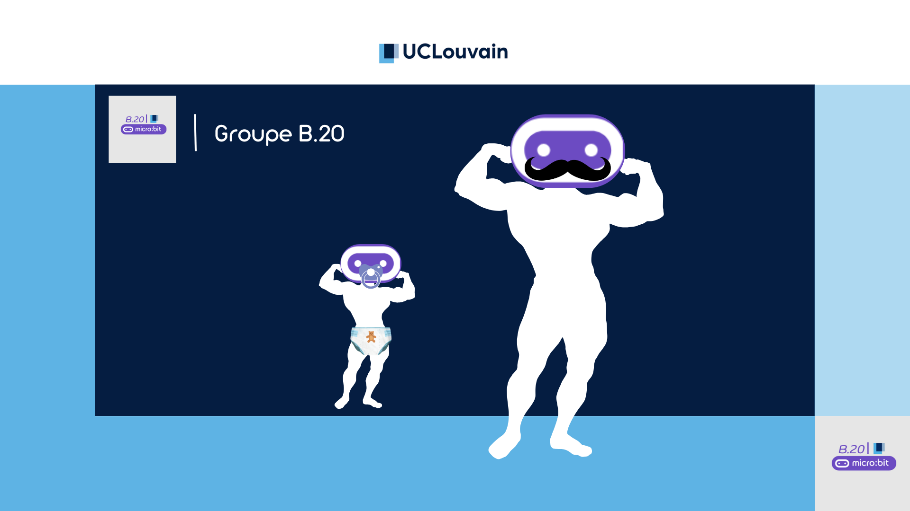

<h1 align="left"> 🌟 APP3 🌟 </h1>

  

 

<h2 align="left">📜 Description de notre projet</h2>

Projet sur le <strong>micro:bit</strong>

 

<h2 align="left">👥 Groupe B.20</h2>

  
  
  

<ul>
  <li><a href="https://github.com/orlettienzo">Enzo Andrade Orletti</a></li>
  <li><a href="https://github.com/VikPr555">Viktor Profirov</a></li>
  <li><a href="https://github.com/jadmrabti">Jad M'Rabti</a></li>
  <li>Pedro Sibomana</li>
  
</ul>
 

<h2 align="left">📞 Contact</h2>
<ul>
  <li>enzo.andrade@student.uclouvain.be</li>
  <li>viktor.profirov@student.uclouvain.be</li>
  <li>jad.mrabti@student.uclouvain.be</li>
  <li>pedro.sibomana@student.uclouvain.be</li>
</ul>
 

<h2 align="left">🎬 Vidéo Exemple</h2>

📹 Vous aurez bientôt le lien vers la vidéo de démonstration de notre projet 🤠

 

<h2 align="left">🚀 Voulez-vous commencer à coder un micro:bit?</h2>

Cliquez ici:

